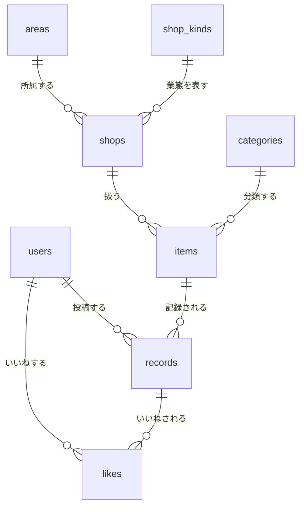

# ER図・テーブル設計

## ER図

## テーブル定義

### users（利用者）

- id
- nickname
- bio
- profile_photo_url
- role
- created_at
- updated_at

**設計判断:** `id` は Supabase Auth の JWT に含まれる `sub`（UUID）をそのまま使う（`CHAR(36)`）。
連番の内部IDは持たない。JWT から取り出した値でそのまま検索でき、対応表が不要になるため。

ユーザーの作成は、初回ログイン時に Next.js が登録APIを呼ぶ方式とする（[要件定義](要件定義.md) 参照）。

### categories（分類マスタ）

- id
- category_name
- category_emoji
- created_at
- updated_at

### shop_kinds（業態マスタ）

- id
- shop_kind_name
- shop_kind_emoji
- created_at
- updated_at

### areas（エリアマスタ）

- id
- area_name
- created_at

### shops（店）

- id
- shop_name
- area_id
- shop_kind_id
- created_at
- updated_at

UNIQUE (shop_name, area_id)

### items（商品）

- id
- shop_id
- item_name
- category_id
- is_seasonal
- created_at
- updated_at

UNIQUE (shop_id, item_name)

### records（記録）

- id
- user_id
- item_id
- eaten_on
- custom_note
- comment
- rating
- photo_url
- created_at
- updated_at

**設計判断:** `is_public` は持たない。MVP では全記録を公開扱いとする。

**削除方針:** 記録の削除は物理削除（`DELETE`）とする。論理削除は行わない。
削除時は Supabase Storage の画像も同時に削除する（Storage の無料枠が 1GB のため、参照されない画像を残さない）。

### likes（いいね）

- id
- record_id
- user_id
- created_at

UNIQUE (record_id, user_id)   ← 同じ記録に同じ人が2回いいねできない（DB制約）

**業務ルール（アプリ側で実装）:**
自分の記録にはいいねできない。DB制約では表現できないため、Service 層で
likes.user_id != records.user_id を検証する。