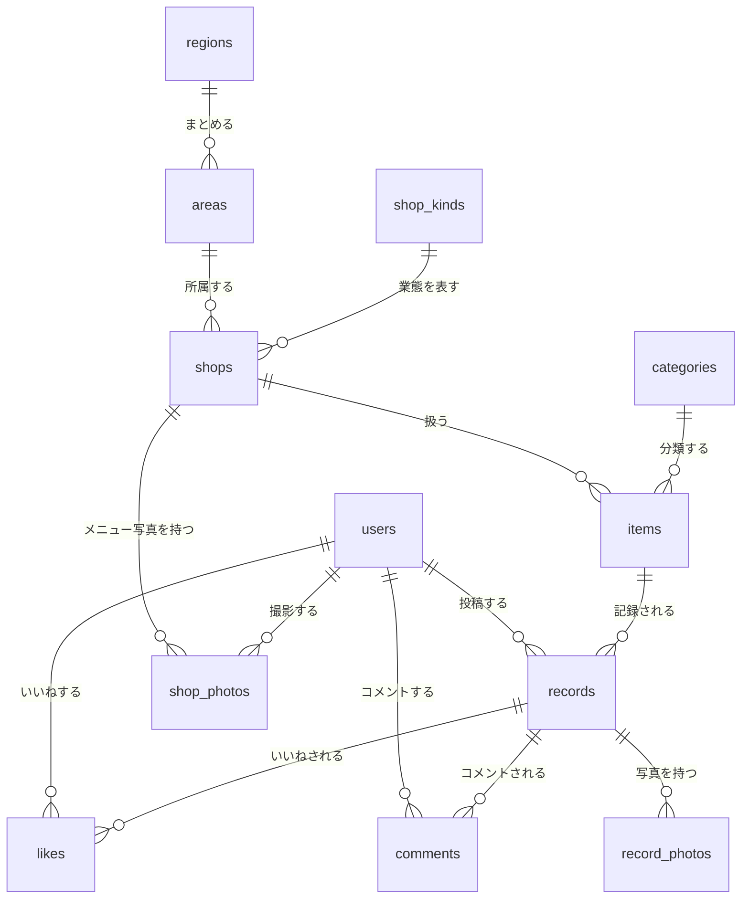

# ER図・テーブル設計

## ER図




## テーブル定義

### users（利用者）

- id
- nickname
- bio
- profile_photo_url
- role
- created_at
- updated_at

**設計判断:** `id` は Supabase Auth の JWT に含まれる `sub`（UUID）をそのまま使う（`CHAR(36)`）。
連番の内部IDは持たない。JWT から取り出した値でそのまま検索でき、対応表が不要になるため。

ユーザーの作成は、初回ログイン時に Next.js が登録APIを呼ぶ方式とする（[要件定義](要件定義.md) 参照）。

### categories（分類マスタ）

- id
- category_name
- category_emoji
- created_at
- updated_at

### shop_kinds（業態マスタ）

- id
- shop_kind_name
- shop_kind_emoji
- created_at
- updated_at


### regions（地域マスタ）

- id
- region_name
- created_at

**設計判断:** `areas` をまとめる上位の単位。国内の地方（関東・近畿など）と、
海外の地域（東アジア・ヨーロッパなど）の両方を扱うため、「地方」ではなく「地域」とする。

エリアの選択画面で地域ごとにグループ表示するために使う。
47都道府県に海外を加えると81件になり、平らに並べると選びにくいため。

| 地域 | エリア |
|---|---|
| 北海道・東北 / 関東 / 中部 / 近畿 / 中国・四国 / 九州・沖縄 | 都道府県（47件）|
| 東アジア / 東南アジア・南アジア / ヨーロッパ / 北米 / 中南米 / オセアニア / 中東 / アフリカ | 国（34件）|

国内を6区分にしているのは、北海道だけが1件のグループになるのを避けるため。
各グループが7〜9件で揃う。

`updated_at` は持たない。地域名は変わらないため。

### areas（エリアマスタ）

- id
- region_id
- area_name
- created_at

**設計判断:** 都道府県と国を同じテーブルで扱う。店の一意性の単位（`UNIQUE (shop_name, area_id)`）
であるため、粒度を揃える必要がある。海外を大陸単位にすると「パリの店」と「ロンドンの店」が
同一になってしまうため、国単位とする。

海外はすべての国を登録せず、代表的な国と各地域の「その他○○」を用意する。
マスタの追加は管理者が行えるため、必要になった時点で足せばよい。

`updated_at` は持たない。エリア名は変わらないため。

表示順は `id` 順とする（初期データを表示したい順に投入する）。
将来、管理者が追加したエリアは末尾に並ぶが、意図して追加したものであるため許容する。


### shops（店）

- id
- shop_name
- area_id
- shop_kind_id
- is_closed
- created_at
- updated_at

UNIQUE (shop_name, area_id)

**設計判断:** `is_closed` は閉店したかどうかを表す。店は削除できないため、
閉店した店はこのフラグで扱う。過去の記録は残したまま、新しい記録の対象から外すことが目的。

| 場面 | 閉店した店の扱い |
|---|---|
| 店一覧 | 表示する（「閉店」バッジを付け、末尾にまとめる） |
| 記録・写真の登録での店の選択 | **候補に出さない**（もう行けないため） |
| 検索の「まだ食べていない」 | **除外する**（もう食べられないため） |
| 過去の記録・写真 | そのまま残す |

閉店の入力は店の編集画面から行い、**全ユーザーが変更できる**（店名や業態の編集と同じ方針）。

店は「正規化した店名 + 都道府県」で一意とする。`place_id` は保存しない。
Google Places は店名と都道府県を取得する入力補助としてのみ使う。
チェーン店は支店名を外して登録し、同一都道府県内の別店舗で買った商品を同じ商品として扱う。
登録フローと受け入れる制約は [要件定義](要件定義.md) を参照。

### items（商品）

- id
- shop_id
- item_name
- category_id
- is_seasonal
- created_at
- updated_at

UNIQUE (shop_id, item_name)

**設計判断:** `category_id` と `is_seasonal` は商品の属性であり、記録ごとには変わらない。
記録の登録画面で商品を新規作成するときに指定し、既存の商品を選んだ場合は設定済みの値を引き継ぐ。
`category_id` は **NOT NULL**（必須）とする。未分類の商品があると分類での絞り込みから漏れ、
ホームの分類ごとの件数も不正確になるため。入力の手間を抑えるため、
`categories` マスタに「その他」を用意し、迷ったときの逃げ道とする。

`items` は全ユーザーで共有するマスタであり、**分類と季節限定の変更は全ユーザーに許可する**。
管理者に限定すると、他ユーザーが誤りを見つけても修正できず運用が滞るため。
一方、分類・業態の**種類そのものを追加する**操作は管理者のみとする（[要件定義](要件定義.md) 参照）。

商品名の表記ゆれは、入力補助（既存商品のサジェスト）と保存前の正規化で防ぐ。

### records（記録）

- id
- user_id
- item_id
- eaten_on
- custom_note
- review
- rating
- price
- created_at
- updated_at

**設計判断:** `is_public` は持たない。MVP では全記録を公開扱いとする。

`review` は食べた感想を書く欄。`rating`（星評価）と対になる。
`comments` テーブル（他ユーザーが書くコメント）と紛らわしいため、列名を `comment` から変更した。
`custom_note` は注文内容の記録（次回そのまま再現するためのメモ）であり、役割が異なる。

`price` は支払った金額であり、値上げや店舗差で変わるため商品ではなく記録に持たせる。
NULL を許容する（毎回の入力を必須にすると記録が続かないため）。
同じ商品の記録を時系列で並べると、価格の推移が読み取れる。

**削除方針:** 記録の削除は物理削除（`DELETE`）とする。論理削除は行わない。

MySQL と Supabase Storage は1つのトランザクションにできないため、順序を定める。

1. MySQL 内で `records`・`record_photos`・`likes`・`comments` をトランザクションで削除する
2. コミットが成功してから、その記録に紐づく写真（複数枚）を Storage から削除する
3. 手順2が失敗した場合は、日次バッチが後から回収する（[要件定義](要件定義.md) 参照）

Storage の無料枠が 1GB のため、参照されない画像を残さない。

### likes（いいね）

- id
- record_id
- user_id
- created_at

UNIQUE (record_id, user_id)   ← 同じ記録に同じ人が2回いいねできない（DB制約）

**削除方針:** 記録を削除したときは、紐づくいいねも同時に削除する
（外部キーに `ON DELETE CASCADE` を設定する）。

**業務ルール（アプリ側で実装）:**
自分の記録にはいいねできない。DB制約では表現できないため、Service 層で
likes.user_id != records.user_id を検証する。

### record_photos（記録の写真）

- id
- record_id
- photo_path
- sort_order
- created_at

UNIQUE (record_id, sort_order)

**設計判断:** 1つの記録に複数枚の写真を持たせる。撮った写真から1枚を選ばせるのではなく、
そのまま残せるようにするため（「写真は撮っているのに探せない」という課題に対応する）。

ここに入るのは**商品の写真だけ**である。種類を区別する必要がないため、`photo_type` は持たない。

メニューと店の写真は、食事の記録ではなく**店の情報**であり、食事をしなくても撮ることがある。
そのため [shop_photos](#shop_photos店の写真) に分離している。

`sort_order` の先頭を**代表写真**とし、記録の一覧・写真タブ・カレンダーではそれを表示する。
複数枚あることは枚数バッジで示し、記録の詳細で全枚数を閲覧できるようにする。

`(record_id, sort_order)` に一意制約を張る。既定値が 0 のため、アプリ側で設定を忘れると
同じ記録に `sort_order = 0` の写真が複数登録され、**代表写真が定まらなくなる**。
並べ替えは、その記録の写真をすべて削除して入れ直す（1記録あたり最大5枚のため負荷は小さい）。

`updated_at` は持たない。写真は差し替えではなく、追加と削除で管理するため。

Storage 上の置き場所は `{user_id}/records/{UUID}.webp` とする。第1要素を `user_id` に
するのは Supabase Storage のアクセス制御がパスの第1要素を見るため、第2要素で種類を
分けるのは孤児ファイルを掃除するバッチが `shop_photos` の写真を誤って削除しないため
（[要件定義](要件定義.md) 参照）。

`photo_path` には公開URLではなくパスを保存する。URL の前半は環境ごとに変わるため、
DB には環境に依存しない値だけを持たせる。

**業務ルール（アプリ側で実装）:**
1記録あたりの写真は**最大5枚**とする。Supabase Storage の無料枠が 1GB のため。
1枚を約150KBに圧縮する前提で、1日1記録・5枚を上限まで使い続けた場合に約3年10か月分に相当する
（利用者が増えると容量は全体で共有されるため、その分早く到達する）。

**削除方針:** 記録を削除したときは、紐づく写真の行も同時に削除する
（外部キーに `ON DELETE CASCADE` を設定する）。Storage の実ファイルは、
`records` の削除手順に従ってコミット後に削除する。

### shop_photos（店の写真）

- id
- shop_id
- user_id
- photo_path
- photo_type
- taken_on
- created_at
- shopfront_key（生成カラム）

**設計判断:** メニューと店の外観の写真は**店に直接紐づける**。理由は3つ。

1. これらは食事の記録ではなく**店の情報**である
2. 「店に行ったが食べずに撮った」場合に、記録がなくても登録できる
3. 記録の写真枚数（最大5枚）を消費しない

`taken_on` は撮影日。記録の登録画面から追加した場合は `records.eaten_on` を、
店の詳細から直接追加した場合は当日を既定値とする。
同じ店でメニューを撮り直すたびに時系列で溜まり、店の詳細では新しい順に並ぶため、
**メニュー改定や価格改定を後から比較できる**。

`photo_type` は `menu`（メニュー表）/ `shopfront`（店の写真）。表示先が異なる。

| 種類 | 店一覧 | 店の詳細 |
|---|---|---|
| `shopfront`（店の写真） | **サムネイルとして表示** | ヘッダーに表示 |
| `menu`（メニュー表） | — | 撮影日の新しい順に一覧 |

店一覧は業態の絵文字だけでは見分けがつきにくいため、店の写真があればそれを優先して表示し、
なければ業態の絵文字を出す。

`updated_at` は持たない。写真は差し替えではなく、追加と削除で管理するため。

Storage 上の置き場所は `{user_id}/shops/{UUID}.webp` とする（`record_photos` とは第2要素で分離する）。

**業務ルール（アプリ側で実装）:**
上限は種類ごとに異なる。

| 種類 | 上限 | 理由 |
|---|---|---|
| `menu`（メニュー表） | 1回の登録につき10枚。**累積は無制限** | 複数ページにわたる。撮り直しを時系列で残すことが目的 |
| `shopfront`（店の写真） | **1人1店舗につき1枚** | 表示に使うのは最新の1枚だけで、古いものは使われないため |

外観写真を撮り直した場合は、**その人自身の前の写真と差し替える**（アップロード時に
自分の `shopfront` があれば削除する）。他人の写真は削除しない。
店一覧のサムネイルには、`taken_on` が最新の `shopfront` を使う。

DB 側でも重複を防ぐ。MySQL は条件付きの一意制約を書けないため、生成カラムを使う。

```sql
shopfront_key VARCHAR(80) GENERATED ALWAYS AS (
  IF(photo_type = 'shopfront', CONCAT(shop_id, ':', user_id), NULL)
) STORED,
CONSTRAINT uk_shop_photos_shopfront UNIQUE (shopfront_key)
```

`menu` の行では `shopfront_key` が NULL になる。MySQL の一意制約は NULL どうしを重複とみなさないため、
メニュー写真は何枚でも登録できる。MySQL には条件付きの一意制約がないため、生成カラムで代用している。

削除できるのは**撮影した本人と管理者のみ**。`shops` は全ユーザー共有のため、
他人が撮った写真を勝手に消せないようにする。

管理者の判定は MySQL の `users.role` で行うため、Supabase Storage のポリシーだけでは判定できない。
本人の削除はブラウザから直接、管理者の削除は Spring Boot 経由でサーバー側の権限を使う
（[要件定義](要件定義.md) 参照）。

### comments（コメント）

- id
- record_id
- user_id
- comment_text
- created_at
- updated_at

**削除方針:** 記録を削除したときは、紐づくコメントも同時に削除する
（外部キーに `ON DELETE CASCADE` を設定する）。

**業務ルール（アプリ側で実装）:**
コメントの編集・削除は投稿者本人のみ。他ユーザーは閲覧のみ可。
